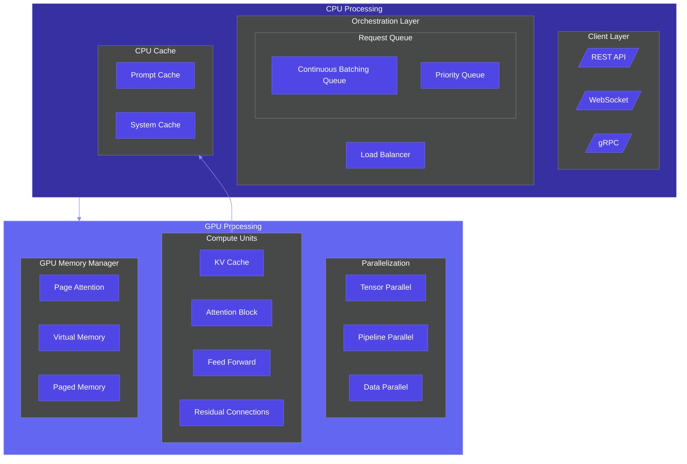

# LLMTUTS: AI-Generated & Expertly Crafted Tutorials and Diagrams

A curated collection of AI-generated tutorials and architecture diagrams, expertly crafted to help developers learn and visualize complex technical concepts across cloud computing, machine learning, DevOps, and more.

## What is LLMTUTS?

LLMTUTS combines the power of AI with expert curation to create:

- **Educational Tutorials** - Step-by-step guides for understanding complex technologies
- **Visual Architecture Diagrams** - Mermaid-based visualizations of system designs
- **Practical Examples** - Real-world applications and implementation patterns
- **Conceptual Explanations** - Clear breakdowns of advanced technical concepts

## Explore Our Content

- **Cloud Architecture** - Tutorials and diagrams for AWS, Azure, GCP solutions
- **MLOps & AI** - Learning resources for machine learning workflows and pipelines
- **System Design** - Visual guides to scalable architecture patterns
- **DevOps & CI/CD** - Educational content on automation workflows
- **Data & Analytics** - Tutorials for ETL pipelines and data platforms
- **Frontend Architecture** - Learning materials for UI architecture patterns

## Quick Start

1. Explore tutorials in the `tutorials/` directory
2. Browse diagrams in the `diagrams/` directory
3. View any Mermaid diagram directly on GitHub with automatic rendering
4. Use our examples as templates for your own projects

## Featured Diagram

## Why LLMTUTS?

- **AI-Enhanced Learning** - Leveraging AI to create clear, comprehensive tutorials
- **Visual Understanding** - Complex concepts explained through intuitive diagrams
- **Practical Application** - Bridging theory and implementation with real examples
- **Expert Curation** - All content is reviewed and refined for accuracy and clarity

## Popular Tutorials

- [Mermaid Basics](tutorials/getting-started/mermaid-basics.md) - Learn the fundamentals of creating diagrams
- [Model Context Protocol](tutorials/concepts/model-context-protocol.md) - Understand specialized AI model interactions

## Contributing

Have ideas for tutorials or diagrams? Contributions are welcome! Please check our [contribution guidelines](CONTRIBUTING.md) for details on how to submit new content.

## License

This repository is licensed under the MIT License - see the [LICENSE](LICENSE) file for details.

---

⭐ Star this repository if you find it useful! ⭐