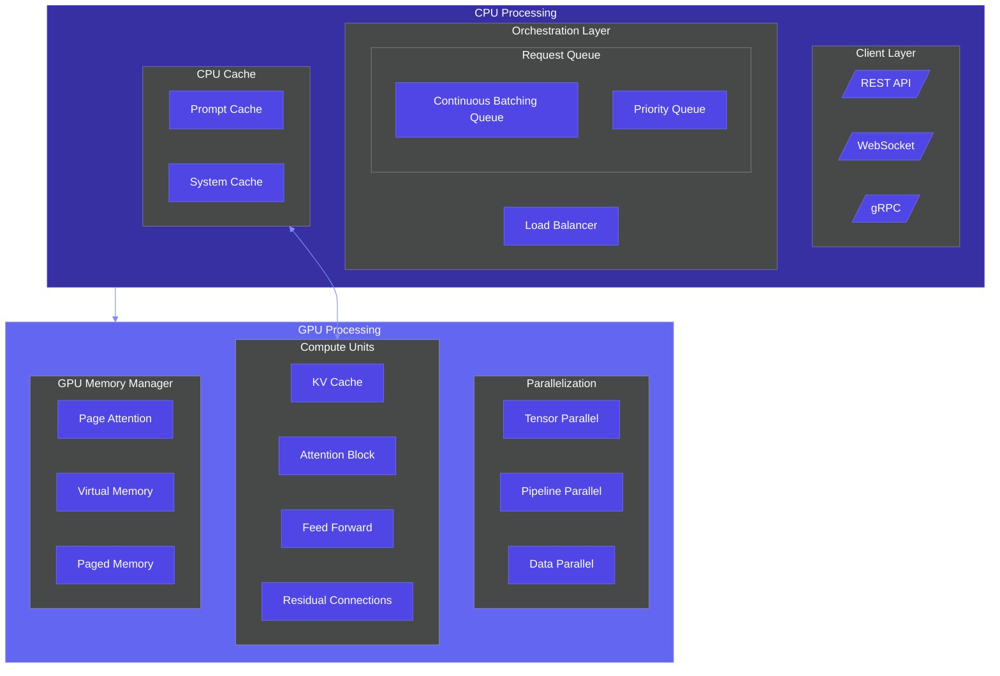

# 🌟 GenAI Architecture Diagrams

  

**The Visual Encyclopedia of Modern Architecture Patterns**

A curated collection of AI-generated architecture diagrams in **Mermaid format**, covering cloud systems, ML pipelines, DevOps workflows, and more!

[Explore Diagrams](#diagram-categories) • [View Tutorials](#tutorials) • [Get Started](#quick-start) • [Contribute](CONTRIBUTING.md)

## 🚀 Quick Start

1. **Browse diagrams** in the `diagrams/` directory by category
2. **View the diagram directly on GitHub** (Mermaid renders automatically)
3. **Copy the Mermaid code** for use in your own projects
4. **Learn how** to create similar diagrams with our [tutorials](tutorials/)

## 📊 Diagram Showcase

Here's a sample of what's in this repository:

### LLM Inference Engine Architecture

## 🗂️ Diagram Categories

Our diagrams are organized into key categories:

### 🌐 [Cloud Architecture](diagrams/cloud/)
AI-generated diagrams showcasing architectures for cloud solutions, including data pipelines, serverless applications, and multi-cloud designs.

### 🧠 [MLOps & AI](diagrams/mlops/)
Visual representations of machine learning operations, training workflows, and inference pipelines for AI systems.

### 🏗️ [System Architecture](diagrams/architecture/)
Comprehensive architecture patterns for building robust and scalable systems.

### 🔄 [DevOps & CI/CD](diagrams/devops/)
Diagrams illustrating workflows, CI/CD pipelines, and automation setups optimized through AI insights.

### 📊 [Data & Analytics](diagrams/data/)
AI-generated layouts for data lakes, ETL pipelines, and analytics platforms.

### 🖥️ [Frontend Architecture](diagrams/frontend/)
UI architecture patterns and state management visualizations.

## 📚 Tutorials

Learn how to create effective architecture diagrams and apply them to your projects:

### Getting Started
- [**Getting Started with Mermaid**](tutorials/getting-started/mermaid-basics.md) - Learn the basics of creating architecture diagrams with Mermaid syntax

### Concepts & Protocols
- [**Model Context Protocol**](tutorials/concepts/model-context-protocol.md) - Understanding why a specialized protocol for AI model interactions is needed despite existing REST APIs
- [**Model Context Protocol (HTML Version)**](tutorials/html-examples/model-context-protocol.html) - Interactive HTML explanation of the Model Context Protocol

### Best Practices
- **Guidelines for creating clear, informative architecture diagrams** (Coming Soon)

### Case Studies
- **Real-world examples showing how these diagrams help in system design** (Coming Soon)

## 💡 Why AI-Generated Architecture?

As AI advances, it opens new possibilities for architectural visualization and design. AI can rapidly create complex diagrams based on patterns and input specifications, providing inspiration for developers and architects alike. This repository celebrates the intersection of AI and software design, offering a glimpse into how AI can support architectural innovation.

## 🔧 Features

- **Categorized Collections**: Find diagrams relevant to your domain
- **Mermaid Format**: All diagrams use Mermaid syntax for easy integration and modification
- **Standardized Documentation**: Consistent format with descriptions, use cases, and component details
- **Dark/Light Mode Compatible**: Diagrams look great in both GitHub dark and light modes
- **Copy-Paste Ready**: Easily use in your own documentation, presentations, or projects

## 🤝 Contributions

Contributions are welcome! If you have an AI-generated architecture diagram you'd like to add, please follow our [contribution guidelines](CONTRIBUTING.md).

We especially appreciate:
- New diagram categories
- Enhanced versions of existing diagrams
- Tutorials and educational content
- Improvements to documentation and examples

## 📋 Future Roadmap

- Interactive examples with live editors
- Theme collections for different architectural styles
- Integration with popular documentation tools
- Animated diagrams for complex processes

## 📜 License

This repository is licensed under the MIT License - see the [LICENSE](LICENSE) file for details.

---

  
⭐ Star this repository if you find it useful! ⭐

