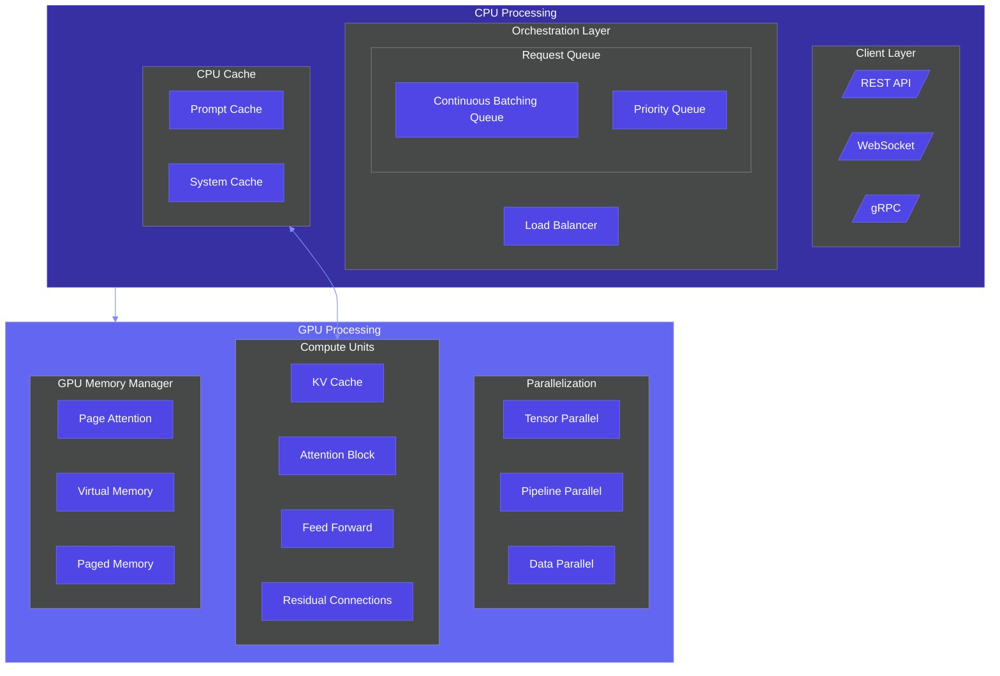

# AI Architecture Diagrams

A curated collection of AI-generated architecture diagrams in Mermaid format, helping developers visualize modern architectural patterns for cloud systems, ML pipelines, DevOps workflows, and more.

## Overview

This repository contains architecture diagrams covering various domains:

- **Cloud Architecture** - AWS, Azure, GCP solutions
- **MLOps & AI** - Machine learning workflows and inference pipelines
- **System Design** - Scalable architecture patterns
- **DevOps & CI/CD** - Automation workflows and pipelines
- **Data & Analytics** - ETL pipelines and data platforms
- **Frontend Architecture** - UI architecture and state management

## Quick Start

1. Browse diagrams in the `diagrams/` directory
2. View any diagram directly on GitHub with automatic Mermaid rendering
3. Copy the code for use in your own projects
4. Learn from our tutorials in the `tutorials/` directory

## Example Diagram

## Features

- **Ready-to-Use Diagrams**: Copy and integrate into your documentation
- **Mermaid Format**: All diagrams use Mermaid for easy modification
- **Categorized Collections**: Find relevant diagrams for your domain
- **Dark/Light Mode Compatible**: Diagrams work in both GitHub themes

## Tutorials

Learn how to create and use architecture diagrams effectively:

- [Mermaid Basics](tutorials/getting-started/mermaid-basics.md)
- [Model Context Protocol](tutorials/concepts/model-context-protocol.md)

## Contributing

Contributions are welcome! Please check our [contribution guidelines](CONTRIBUTING.md) for details on how to submit new diagrams or improvements.

## License

This repository is licensed under the MIT License - see the [LICENSE](LICENSE) file for details.

---

⭐ Star this repository if you find it useful! ⭐