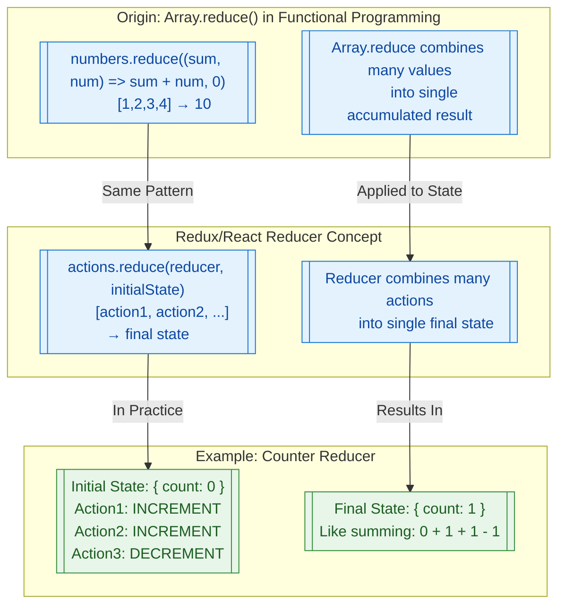

```mermaid
graph TB
    subgraph "Origin: Array.reduce() in Functional Programming"
        A1[["numbers.reduce((sum, num) => sum + num, 0)
        [1,2,3,4] → 10"]]
        A2[["Array.reduce combines many values
        into single accumulated result"]]
    end

    subgraph "Redux/React Reducer Concept"
        B1[["actions.reduce(reducer, initialState)
        [action1, action2, ...] → final state"]]
        B2[["Reducer combines many actions
        into single final state"]]
    end

    subgraph "Example: Counter Reducer"
        C1[["Initial State: { count: 0 }
        Action1: INCREMENT
        Action2: INCREMENT
        Action3: DECREMENT"]]
        C2[["Final State: { count: 1 }
        Like summing: 0 + 1 + 1 - 1"]]
    end

    A1 -->|"Same Pattern"| B1
    A2 -->|"Applied to State"| B2
    B1 -->|"In Practice"| C1
    B2 -->|"Results In"| C2

    classDef concept fill:#e3f2fd,stroke:#1976d2,color:#0d47a1
    classDef example fill:#e8f5e9,stroke:#388e3c,color:#1b5e20
    
    class A1,A2 concept
    class B1,B2 concept
    class C1,C2 example
```
