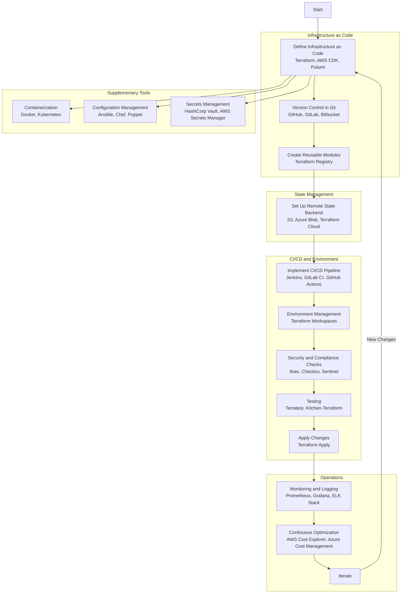

```mermaid
graph TD
    A[Start] --> B[Define Infrastructure as Code]
    B --> C[Version Control in Git]
    C --> D[Create Reusable Modules]
    D --> E[Set Up Remote State Backend]
    E --> F[Implement CI/CD Pipeline]
    F --> G[Environment Management]
    G --> H[Security and Compliance Checks]
    H --> I[Testing]
    I --> J[Apply Changes]
    J --> K[Monitoring and Logging]
    K --> L[Continuous Optimization]
    L --> M[Iterate]
    M -->|New Changes| B

    subgraph "Infrastructure as Code"
    B[Define Infrastructure as Code<br>Terraform, AWS CDK, Pulumi]
    C[Version Control in Git<br>GitHub, GitLab, Bitbucket]
    D[Create Reusable Modules<br>Terraform Registry]
    end

    subgraph "State Management"
    E[Set Up Remote State Backend<br>S3, Azure Blob, Terraform Cloud]
    end

    subgraph "CI/CD and Environment"
    F[Implement CI/CD Pipeline<br>Jenkins, GitLab CI, GitHub Actions]
    G[Environment Management<br>Terraform Workspaces]
    H[Security and Compliance Checks<br>tfsec, Checkov, Sentinel]
    I[Testing<br>Terratest, Kitchen-Terraform]
    J[Apply Changes<br>Terraform Apply]
    end

    subgraph "Operations"
    K[Monitoring and Logging<br>Prometheus, Grafana, ELK Stack]
    L[Continuous Optimization<br>AWS Cost Explorer, Azure Cost Management]
    M[Iterate]
    end

    subgraph "Supplementary Tools"
    N[Containerization<br>Docker, Kubernetes]
    O[Configuration Management<br>Ansible, Chef, Puppet]
    P[Secrets Management<br>HashiCorp Vault, AWS Secrets Manager]
    end

    B --> N
    B --> O
    B --> P
```
