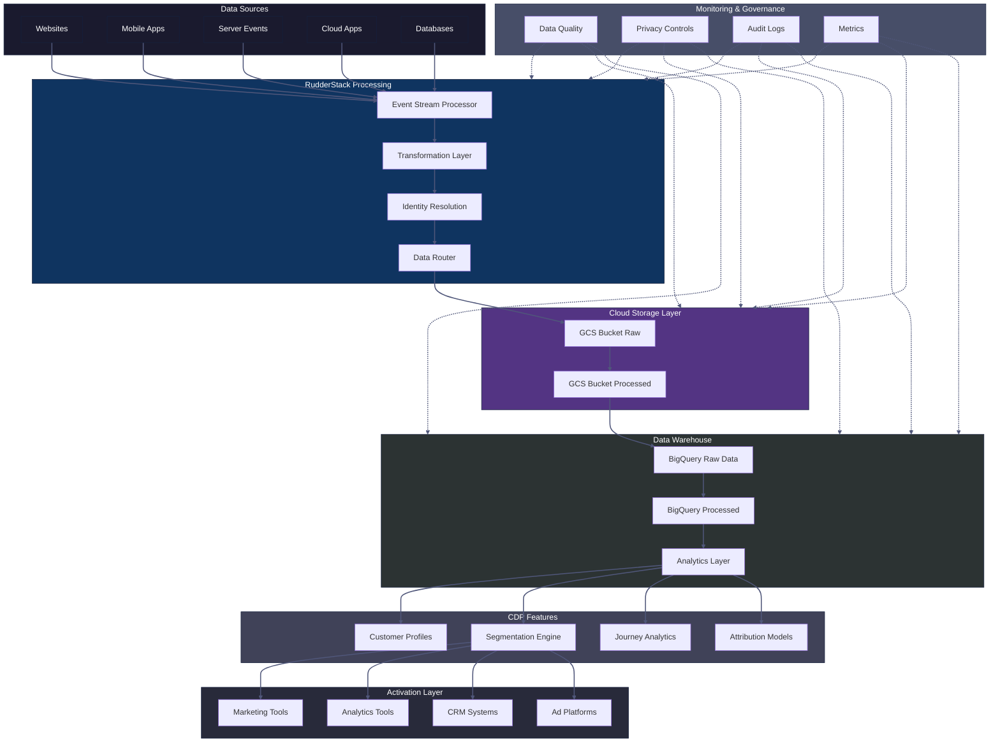

```mermaid
flowchart TB
    %% Modern AI-inspired color scheme
    
    subgraph Sources ["Data Sources"]
        style Sources fill:#1a1a2e,stroke:#16213e,color:#fff
        A1[Websites]
        A2[Mobile Apps]
        A3[Server Events]
        A4[Cloud Apps]
        A5[Databases]
    end

    subgraph Processing ["RudderStack Processing"]
        style Processing fill:#0f3460,stroke:#16213e,color:#fff
        B[Event Stream Processor]
        C[Transformation Layer]
        D[Identity Resolution]
        E[Data Router]
    end

    subgraph Storage ["Cloud Storage Layer"]
        style Storage fill:#533483,stroke:#16213e,color:#fff
        F1[GCS Bucket Raw]
        F2[GCS Bucket Processed]
    end

    subgraph Warehouse ["Data Warehouse"]
        style Warehouse fill:#2c3333,stroke:#16213e,color:#fff
        G1[BigQuery Raw Data]
        G2[BigQuery Processed]
        G3[Analytics Layer]
    end

    subgraph Features ["CDP Features"]
        style Features fill:#404258,stroke:#16213e,color:#fff
        H1[Customer Profiles]
        H2[Segmentation Engine]
        H3[Journey Analytics]
        H4[Attribution Models]
    end

    subgraph Activation ["Activation Layer"]
        style Activation fill:#282a3a,stroke:#16213e,color:#fff
        I1[Marketing Tools]
        I2[Analytics Tools]
        I3[CRM Systems]
        I4[Ad Platforms]
    end

    subgraph Monitoring ["Monitoring & Governance"]
        style Monitoring fill:#474e68,stroke:#16213e,color:#fff
        J1[Data Quality]
        J2[Privacy Controls]
        J3[Audit Logs]
        J4[Metrics]
    end

    %% Node colors
    style A1 fill:#1a1a2e,stroke:#16213e,color:#fff
    style A2 fill:#1a1a2e,stroke:#16213e,color:#fff
    style A3 fill:#1a1a2e,stroke:#16213e,color:#fff
    style A4 fill:#1a1a2e,stroke:#16213e,color:#fff
    style A5 fill:#1a1a2e,stroke:#16213e,color:#fff

    A1 & A2 & A3 & A4 & A5 --> B
    B --> C --> D --> E
    E --> F1 --> F2
    F2 --> G1 --> G2 --> G3
    G3 --> H1 & H2 & H3 & H4
    H2 --> I1 & I2 & I3 & I4

    J1 & J2 & J3 & J4 -.-> Processing & Storage & Warehouse

    %% Link colors
    linkStyle default stroke:#50577a,stroke-width:2px
```
