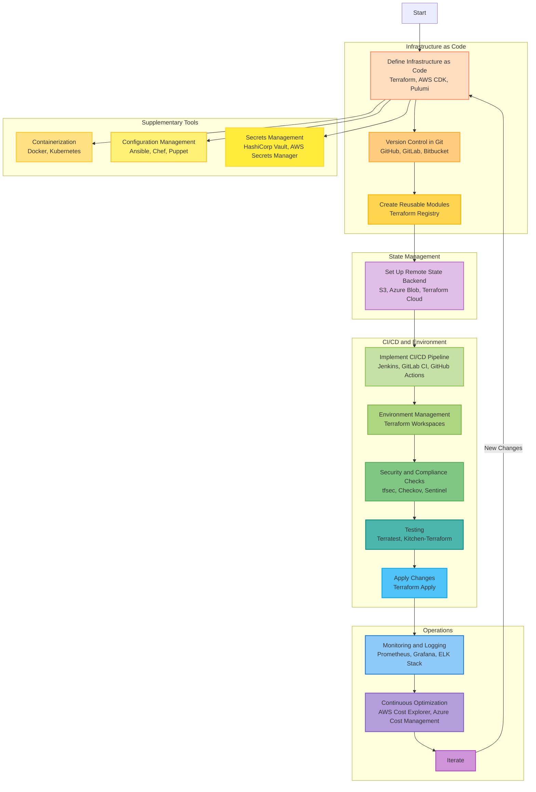

# DevOps Terraform Workflow

## Overview
This diagram illustrates a comprehensive DevOps workflow for infrastructure management using Terraform, from initial code definition through continuous optimization. It shows the end-to-end lifecycle of infrastructure as code with integration points for CI/CD, monitoring, and supplementary tools.

## Use Cases
- Building a mature DevOps practice for infrastructure management
- Setting up infrastructure as code (IaC) workflows in cloud environments
- Implementing GitOps principles for infrastructure deployments
- Establishing automated testing and compliance for infrastructure changes

## Architecture Diagram

## Key Components

### Infrastructure as Code
- **Define Infrastructure as Code**: Create declarative configuration files using tools like Terraform, AWS CDK, or Pulumi
- **Version Control in Git**: Store and version infrastructure code in repositories like GitHub, GitLab, or Bitbucket
- **Create Reusable Modules**: Develop modular, reusable infrastructure components utilizing the Terraform Registry

### State Management
- **Remote State Backend**: Store Terraform state files remotely in S3, Azure Blob Storage, or Terraform Cloud for collaboration and versioning

### CI/CD and Environment
- **CI/CD Pipeline**: Automate infrastructure deployments using Jenkins, GitLab CI, or GitHub Actions
- **Environment Management**: Manage multiple environments (dev, staging, prod) using Terraform workspaces
- **Security and Compliance Checks**: Implement automated security scanning with tools like tfsec, Checkov, and Sentinel policies
- **Testing**: Validate infrastructure code with Terratest or Kitchen-Terraform before deployment
- **Apply Changes**: Execute Terraform apply to deploy infrastructure changes safely

### Operations
- **Monitoring and Logging**: Track infrastructure performance and issues with Prometheus, Grafana, and ELK Stack
- **Continuous Optimization**: Regularly review and optimize costs using AWS Cost Explorer or Azure Cost Management
- **Iterate**: Continuously improve infrastructure based on operational feedback

### Supplementary Tools
- **Containerization**: Integrate with Docker and Kubernetes for containerized workloads
- **Configuration Management**: Use Ansible, Chef, or Puppet for application configuration
- **Secrets Management**: Secure sensitive data with HashiCorp Vault or AWS Secrets Manager

## Best Practices
1. **State Locking**: Implement state locking to prevent concurrent modifications
2. **Plan Review**: Always review Terraform plans before applying changes
3. **Module Versioning**: Pin module versions for predictable deployments
4. **Pre-commit Hooks**: Use pre-commit hooks for basic validation before pushing code
5. **Least Privilege**: Apply principle of least privilege to service accounts used for deployments
6. **Import Existing Resources**: Import existing infrastructure into Terraform when migrating
7. **Drift Detection**: Regularly check for infrastructure drift
8. **Documentation**: Maintain comprehensive README files for each module

## Related Architectures
- CI/CD Pipeline Architecture
- Cloud Resource Organization Models
- GitOps Workflow Diagrams