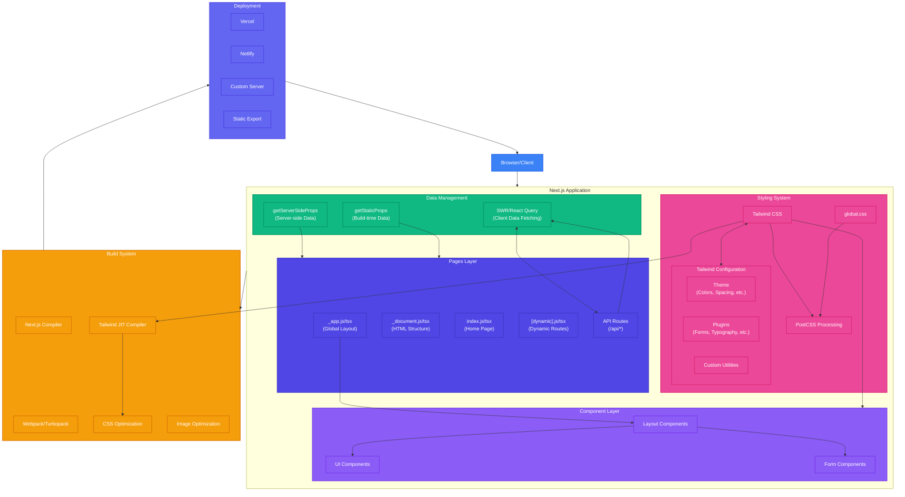

# Next.js and Tailwind CSS Architecture

## Overview
This diagram illustrates the architecture and workflow of a modern frontend application built with Next.js and Tailwind CSS. It shows how these technologies interact to create a seamless development experience from component creation to production deployment.

## Use Cases
- Building responsive, performant web applications
- Creating component-based UI systems with utility-first styling
- Implementing server-side rendering and static site generation
- Developing full-stack applications with API routes

## Architecture Diagram

## Key Components

### Next.js Framework Elements
- **Pages Layer**: Contains route-based components and API routes
  - `_app.js/tsx`: Wraps all pages, manages global state and layouts
  - `_document.js/tsx`: Customizes the HTML structure
  - Index and dynamic pages: Represent application routes
  - API Routes: Serverless functions for backend operations

- **Component Layer**: Reusable UI components
  - Layout Components: Structural elements (header, footer, layout)
  - UI Components: Buttons, cards, modals, etc.
  - Form Components: Input elements with validation

- **Data Management**:
  - SWR/React Query: Client-side data fetching with caching
  - `getServerSideProps`: Server-side rendering with fresh data
  - `getStaticProps`: Static site generation with build-time data

### Tailwind CSS Integration
- **Tailwind CSS**: Utility-first CSS framework
- **Configuration**:
  - Theme customization: Colors, spacing, typography, etc.
  - Plugins: Additional utilities and components
  - Custom utilities: Extended functionality
- **Processing**:
  - PostCSS: Processes and optimizes CSS
  - Global CSS: Custom styles and Tailwind imports

### Build & Deployment
- **Build System**:
  - Next.js compiler: Transforms and optimizes React code
  - Bundler: Packages code for production
  - Tailwind JIT: Just-in-time compilation of CSS utilities
  - Optimizations: CSS and image processing
- **Deployment Options**:
  - Vercel: Optimized for Next.js
  - Netlify: General JAMstack hosting
  - Custom server: Self-hosted Node.js
  - Static export: Pure HTML/CSS/JS output

## Implementation Benefits

### Developer Experience
- **Component-Driven Development**: Build UIs with composable components
- **Rapid Styling**: Apply styles directly in markup without context switching
- **Hot Reload**: Instant feedback during development
- **TypeScript Support**: Type safety throughout the application

### Performance
- **Server-Side Rendering**: Improved initial load time and SEO
- **Automatic Code Splitting**: Only load JavaScript needed for each page
- **CSS Optimization**: Only include CSS utilities that are used
- **Image Optimization**: Automatic resizing and format conversion

### Scalability
- **API Routes**: Backend functionality without separate services
- **Incremental Static Regeneration**: Update static content without rebuilds
- **Middleware**: Process requests before rendering
- **Next.js Edge Functions**: Run code at the edge for improved performance

## Related Architectures
- React SPA with CSS-in-JS
- Astro with Tailwind CSS
- Vue.js with Nuxt and Tailwind CSS
- Remix with Tailwind CSS