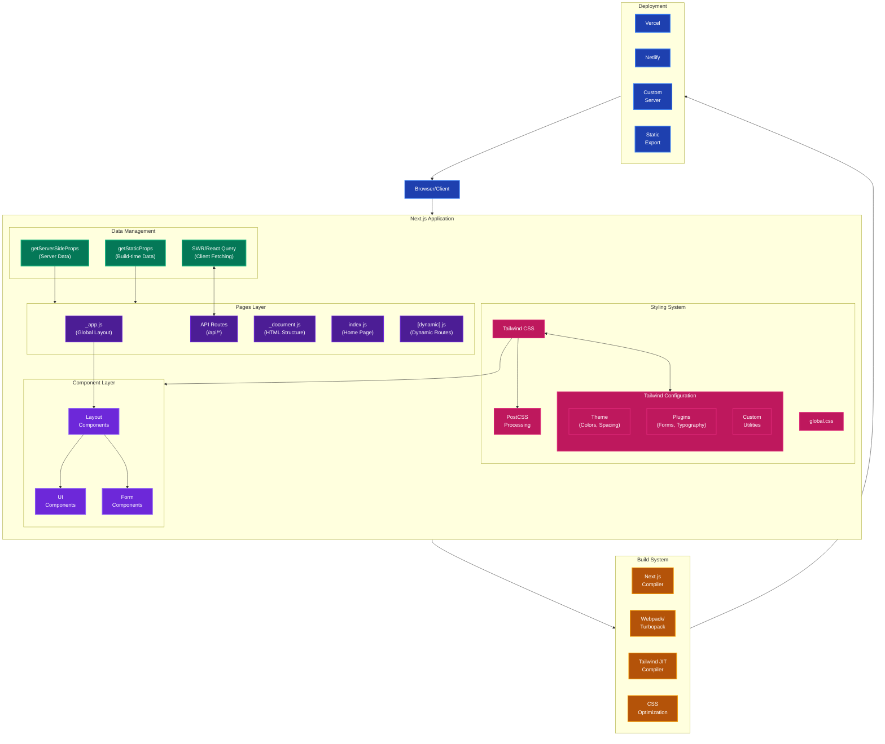

# Next.js and Tailwind CSS Architecture

## Overview
This diagram illustrates the architecture and workflow of a modern frontend application built with Next.js and Tailwind CSS. It shows how these technologies interact to create a seamless development experience from component creation to production deployment.

## Use Cases
- Building responsive, performant web applications
- Creating component-based UI systems with utility-first styling
- Implementing server-side rendering and static site generation
- Developing full-stack applications with API routes

## Architecture Diagram

## Key Components

### Next.js Framework Elements

| Component | Description |
|-----------|-------------|
| **Pages Layer** | Route-based components and API endpoints |
| `_app.js` | Wraps all pages, manages global state and layouts |
| `_document.js` | Customizes the HTML document structure |
| `index.js` & Dynamic Routes | Application pages and parameterized routes |
| API Routes | Serverless functions for backend operations |
| **Component Layer** | Reusable UI building blocks |
| Layout Components | Page structure (header, footer, navigation) |
| UI Components | Interface elements (buttons, cards, modals) |
| Form Components | Input elements with validation logic |
| **Data Management** | Multiple data fetching strategies |
| Client-side Fetching | SWR/React Query with caching and revalidation |
| Server-side Rendering | Fresh data on each request via `getServerSideProps` |
| Static Generation | Build-time data fetching via `getStaticProps` |

### Tailwind CSS Integration

| Component | Description |
|-----------|-------------|
| **Core** | Utility-first CSS framework |
| **Configuration** | Customization through `tailwind.config.js` |
| Theme | Colors, spacing, typography, breakpoints |
| Plugins | Additional utilities (forms, typography, etc.) |
| Custom Utilities | Extended functionality for project-specific needs |
| **Processing** | Compilation and optimization pipeline |
| PostCSS | Processes and transforms CSS |
| JIT Mode | Just-in-time generation of utility classes |

### Build & Deployment

| Component | Description |
|-----------|-------------|
| **Build System** | Code compilation and optimization |
| Next.js Compiler | Transforms and optimizes React code |
| Bundler | Packages application for production |
| CSS Optimization | Removes unused styles, minifies CSS |
| **Deployment Options** | Various hosting strategies |
| Vercel | Platform optimized for Next.js applications |
| Netlify | General JAMstack hosting platform |
| Custom Server | Self-hosted Node.js deployment |
| Static Export | Pure HTML/CSS/JS output for any host |

## Implementation Benefits

### Developer Experience
- **Component-Driven Development**: Build UIs with composable, reusable components
- **Rapid Styling**: Apply styles directly in markup without context switching
- **Hot Reload**: Instant feedback during development process
- **TypeScript Support**: End-to-end type safety throughout the application

### Performance
- **Server-Side Rendering**: Improved initial load time and SEO performance
- **Automatic Code Splitting**: Only load JavaScript needed for each page
- **CSS Optimization**: Include only CSS utilities that are actually used
- **Image Optimization**: Automatic resizing, format conversion, and lazy loading

### Scalability
- **API Routes**: Backend functionality without separate services
- **Incremental Static Regeneration**: Update static content without full rebuilds
- **Middleware**: Process requests before rendering begins
- **Edge Functions**: Run code at the edge for improved performance

## Related Architectures
- React SPA with CSS-in-JS (styled-components, emotion)
- Astro with Tailwind CSS
- Vue.js with Nuxt and Tailwind CSS
- Remix with Tailwind CSS