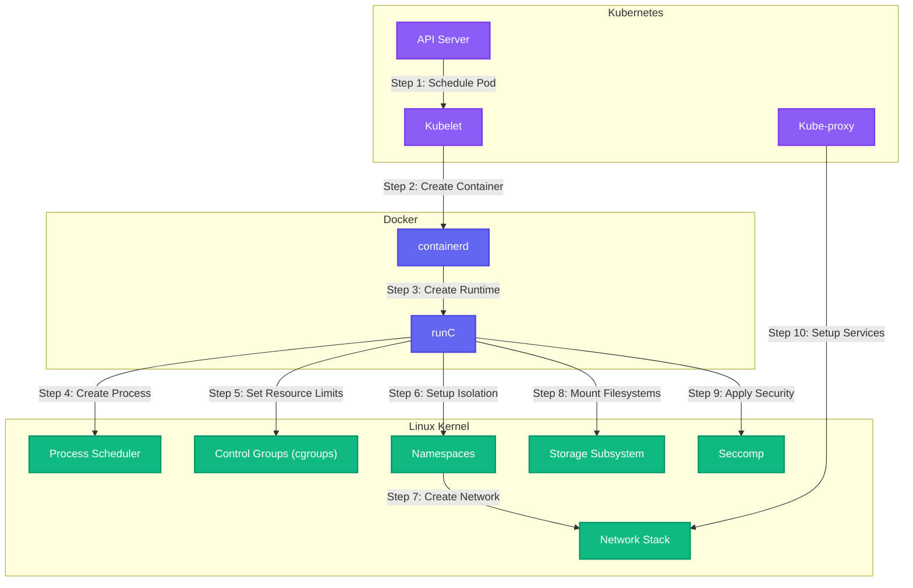

```mermaid
flowchart TD
    subgraph LinuxKernel["Linux Kernel"]
        direction TB
        Scheduler["Process Scheduler"]
        CGroups["Control Groups (cgroups)"]
        Namespaces["Namespaces"]
        NetStack["Network Stack"]
        Storage["Storage Subsystem"]
        SecComp["Seccomp"]
    end

    subgraph Docker["Docker"]
        ContainerD["containerd"]
        RunC["runC"]
    end

    subgraph Kubernetes["Kubernetes"]
        APIServer["API Server"]
        Kubelet["Kubelet"]
        KubeProxy["Kube-proxy"]
    end

    APIServer --> |"Step 1: Schedule Pod"| Kubelet
    Kubelet --> |"Step 2: Create Container"| ContainerD
    ContainerD --> |"Step 3: Create Runtime"| RunC
    RunC --> |"Step 4: Create Process"| Scheduler
    RunC --> |"Step 5: Set Resource Limits"| CGroups
    RunC --> |"Step 6: Setup Isolation"| Namespaces
    Namespaces --> |"Step 7: Create Network"| NetStack
    RunC --> |"Step 8: Mount Filesystems"| Storage
    RunC --> |"Step 9: Apply Security"| SecComp
    KubeProxy --> |"Step 10: Setup Services"| NetStack

    classDef kernel fill:#10B981,stroke:#059669,stroke-width:2px,color:#ffffff
    classDef docker fill:#6366F1,stroke:#4F46E5,stroke-width:2px,color:#ffffff
    classDef kubernetes fill:#8B5CF6,stroke:#7C3AED,stroke-width:2px,color:#ffffff
    class Scheduler,CGroups,Namespaces,NetStack,Storage,SecComp kernel
    class ContainerD,RunC docker
    class APIServer,Kubelet,KubeProxy kubernetes
```
