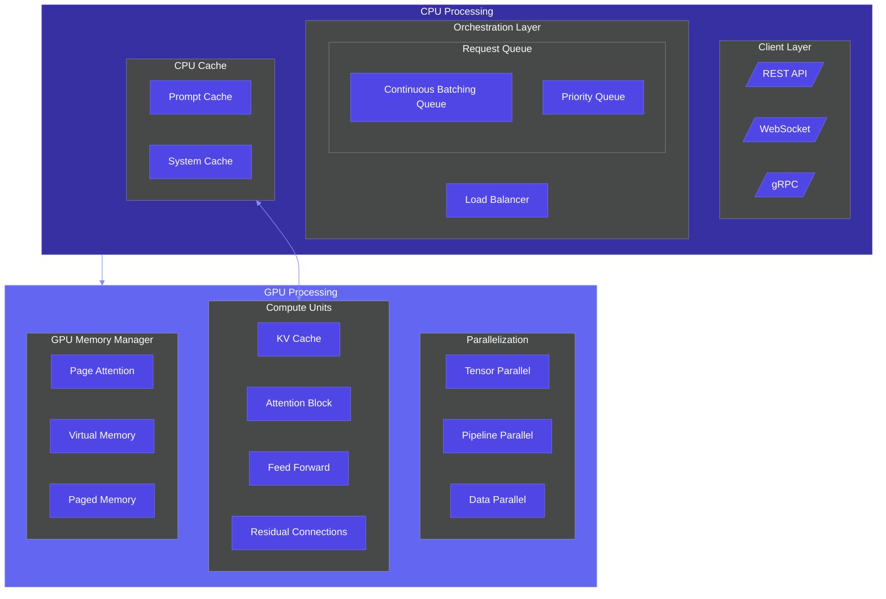

```mermaid
%%{init: {'theme': 'dark', 'themeVariables': { 'primaryColor': '#6366f1', 'primaryTextColor': '#fff', 'primaryBorderColor': '#818cf8', 'lineColor': '#818cf8', 'secondaryColor': '#4f46e5', 'tertiaryColor': '#4338ca'}}}%%
flowchart TB
    subgraph CPU["CPU Processing"]
        subgraph Client["Client Layer"]
            API[/"REST API"/]
            WS[/"WebSocket"/]
            GRPC[/"gRPC"/]
        end

        subgraph Orchestration["Orchestration Layer"]
            LB["Load Balancer"]
            subgraph Queue["Request Queue"]
                CQ["Continuous Batching Queue"]
                PQ["Priority Queue"]
            end
        end

        subgraph CacheSystem["CPU Cache"]
            PC["Prompt Cache"]
            SC["System Cache"]
        end
    end

    subgraph GPU["GPU Processing"]
        subgraph Parallel["Parallelization"]
            TP["Tensor Parallel"]
            PP["Pipeline Parallel"]
            DP["Data Parallel"]
        end

        subgraph Compute["Compute Units"]
            KV["KV Cache"]
            AT["Attention Block"]
            FF["Feed Forward"]
            RES["Residual Connections"]
        end

        subgraph Memory["GPU Memory Manager"]
            PA["Page Attention"]
            VM["Virtual Memory"]
            PG["Paged Memory"]
        end
    end

    CPU --> GPU
    CacheSystem <--> Compute
    
    classDef default fill:#2d3748,stroke:#4a5568,color:#fff
    classDef cpublock fill:#3730a3,stroke:#4338ca,color:#fff
    classDef gpublock fill:#6366f1,stroke:#818cf8,color:#fff
    classDef primary fill:#4f46e5,stroke:#6366f1,color:#fff
    
    class CPU cpublock
    class GPU gpublock
    class API,WS,GRPC,LB,CQ,PQ,PC,SC primary
    class TP,PP,DP,KV,AT,FF,RES,PA,VM,PG primary
```
