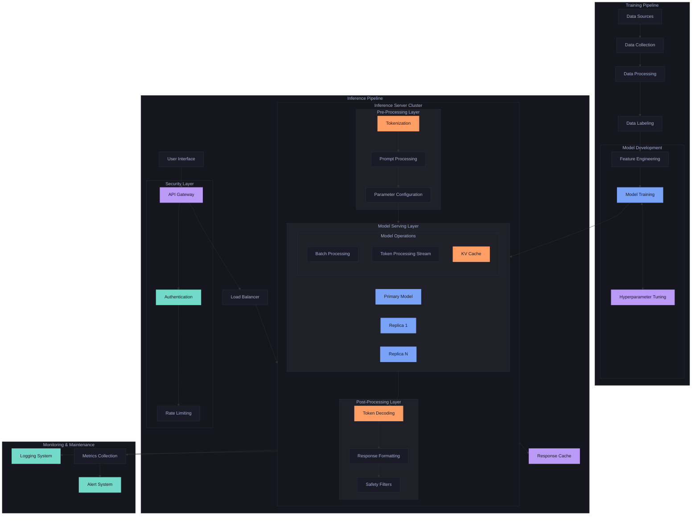

# Generative AI Model Workflow

## Overview
This diagram illustrates the comprehensive workflow for generative AI systems, covering both the training pipeline and inference infrastructure. It shows the end-to-end process from data collection to model serving, including monitoring and security components.

## Use Cases
- Building production-ready generative AI systems
- Designing MLOps infrastructure for large language models
- Planning scalable inference architectures for AI services 
- Understanding the full lifecycle of generative AI applications

## Architecture Diagram

## Key Components

### Training Pipeline
- **Data Sources**: Original sources of training data (web, books, specialized datasets)
- **Data Collection**: Gathering and aggregating data from various sources
- **Data Processing**: Cleaning, filtering, and normalizing data for training
- **Data Labeling**: Adding annotations or classifications when needed
- **Feature Engineering**: Transforming data into suitable formats for model training
- **Model Training**: The process of training the generative AI model
- **Hyperparameter Tuning**: Optimizing model parameters to improve performance

### Inference Pipeline
- **User Interface**: Frontend application for user interaction
- **API Gateway**: Centralized entry point for all API requests
- **Load Balancer**: Distributes requests across inference servers
- **Response Cache**: Stores common responses to reduce computation needs

#### Pre-Processing Layer
- **Tokenization**: Converting text into tokens that the model can process
- **Prompt Processing**: Formatting and enhancing user prompts
- **Parameter Configuration**: Setting generation parameters (temperature, top-k, etc.)

#### Model Serving Layer
- **Primary Model**: Main model instance handling inference requests
- **Replicas**: Additional model instances for scaling and redundancy
- **Batch Processing**: Handling multiple requests in batches for efficiency
- **Token Processing Stream**: Processing tokens incrementally for streaming responses
- **KV Cache**: Caching key-value pairs to accelerate generation

#### Post-Processing Layer
- **Token Decoding**: Converting model outputs back to human-readable format
- **Response Formatting**: Structuring the response according to API requirements
- **Safety Filters**: Filtering out unsafe or inappropriate content

### Security Layer
- **Authentication**: Verifying user identity and permissions
- **Rate Limiting**: Preventing abuse by limiting request frequency

### Monitoring & Maintenance
- **Logging System**: Recording system events and user interactions
- **Metrics Collection**: Gathering performance and usage statistics
- **Alert System**: Notifying operators of issues or anomalies

## Performance Considerations
- Horizontal scaling through model replicas handles increased request volume
- Response caching significantly reduces computation for common queries
- KV Cache optimizes token generation speed during inference
- Batch processing improves throughput for non-streaming requests

## Implementation Notes
- This architecture can be deployed on cloud platforms (AWS, GCP, Azure) or on-premises
- Container orchestration (Kubernetes) is commonly used for managing inference servers
- Model weights can be distributed across multiple GPUs using tensor or pipeline parallelism
- Monitoring should track both technical metrics and model quality metrics

## Related Architectures
- LLM Inference Server Architecture
- MLOps CI/CD Pipeline
- Model Fine-tuning Workflow
- Model Evaluation Framework