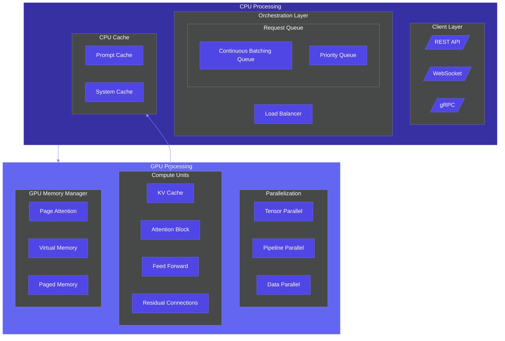

# LLM Inference Engine Architecture

## Overview
This diagram illustrates the architecture of a Large Language Model (LLM) inference engine, showing the flow from client requests through CPU orchestration to GPU-accelerated processing.

## Use Cases
- High-performance LLM serving infrastructure
- ML inference optimization for production systems
- Scaling language model inference with efficient resource utilization
- Edge and cloud deployment of language models

## Architecture Diagram

## Key Components

### Client Layer
- **REST API**: Standard HTTP-based interface for synchronous requests
- **WebSocket**: Persistent connection for streaming inference results
- **gRPC**: High-performance RPC framework for service-to-service communication

### Orchestration Layer
- **Load Balancer**: Distributes incoming requests across multiple inference servers
- **Continuous Batching Queue**: Dynamically batches requests for optimal throughput
- **Priority Queue**: Manages request priority for SLA compliance

### CPU Cache
- **Prompt Cache**: Stores frequently used prompts to avoid reprocessing
- **System Cache**: Caches system-level configurations and parameters

### Parallelization
- **Tensor Parallel**: Distributes tensor computations across multiple GPUs
- **Pipeline Parallel**: Splits model layers across GPUs in a pipeline fashion
- **Data Parallel**: Replicates model across GPUs for independent batch processing

### Compute Units
- **KV Cache**: Caches key-value pairs from attention layers to accelerate generation
- **Attention Block**: Processes attention mechanisms in transformer architecture
- **Feed Forward**: Handles feed-forward neural network components
- **Residual Connections**: Implements residual connections for gradient flow

### GPU Memory Manager
- **Page Attention**: Memory paging strategies specific to attention mechanisms
- **Virtual Memory**: Creates abstraction layer for managing physical GPU memory
- **Paged Memory**: Implements memory paging for efficient utilization

## Performance Considerations
- The continuous batching queue optimizes throughput by dynamically batching requests
- KV cache significantly reduces computation needs during token generation
- Multiple parallelization strategies can be combined based on hardware and model size
- Memory management is critical for handling large models and long sequences