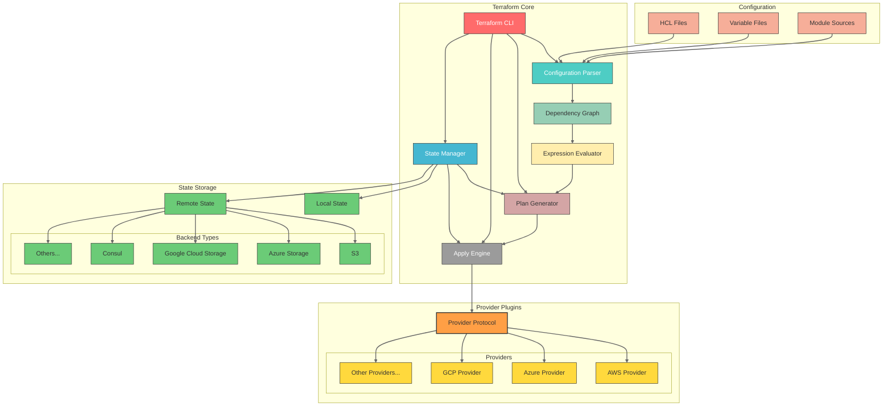

```mermaid
graph TB
    %% Color definitions
    classDef cliStyle fill:#FF6B6B,stroke:#333,color:white
    classDef parserStyle fill:#4ECDC4,stroke:#333,color:white
    classDef stateStyle fill:#45B7D1,stroke:#333,color:white
    classDef graphStyle fill:#96CEB4,stroke:#333
    classDef evalStyle fill:#FFEEAD,stroke:#333
    classDef planStyle fill:#D4A5A5,stroke:#333
    classDef applyStyle fill:#9B9B9B,stroke:#333,color:white
    classDef providerStyle fill:#FFD93D,stroke:#333
    classDef storageStyle fill:#6BCB77,stroke:#333
    classDef configStyle fill:#F6AE99,stroke:#333

    subgraph "Terraform Core"
        CLI[Terraform CLI]:::cliStyle
        Parser[Configuration Parser]:::parserStyle
        State[State Manager]:::stateStyle
        Graph[Dependency Graph]:::graphStyle
        Eval[Expression Evaluator]:::evalStyle
        Plan[Plan Generator]:::planStyle
        Apply[Apply Engine]:::applyStyle
    end

    subgraph "Provider Plugins"
        PP[Provider Protocol]
        style PP fill:#FF9F45,stroke:#333,stroke-width:2px
        
        subgraph "Providers"
            AWS[AWS Provider]:::providerStyle
            Azure[Azure Provider]:::providerStyle
            GCP[GCP Provider]:::providerStyle
            Others[Other Providers...]:::providerStyle
        end
    end

    subgraph "State Storage"
        Local[Local State]:::storageStyle
        Remote[Remote State]:::storageStyle
        subgraph "Backend Types"
            S3[S3]:::storageStyle
            Azure_Storage[Azure Storage]:::storageStyle
            GCS[Google Cloud Storage]:::storageStyle
            Consul[Consul]:::storageStyle
            Others_Backend[Others...]:::storageStyle
        end
    end

    subgraph "Configuration"
        HCL[HCL Files]:::configStyle
        Vars[Variable Files]:::configStyle
        Module[Module Sources]:::configStyle
    end

    %% Relationships
    HCL --> Parser
    Vars --> Parser
    Module --> Parser
    Parser --> Graph
    Graph --> Eval
    Eval --> Plan
    Plan --> Apply
    State --> Plan
    State --> Apply
    Apply --> PP
    PP --> AWS
    PP --> Azure
    PP --> GCP
    PP --> Others
    State --> Local
    State --> Remote
    Remote --> S3
    Remote --> Azure_Storage
    Remote --> GCS
    Remote --> Consul
    Remote --> Others_Backend
    CLI --> Parser
    CLI --> Plan
    CLI --> Apply
    CLI --> State

    %% Link Styles
    linkStyle default stroke:#666,stroke-width:2px
```
