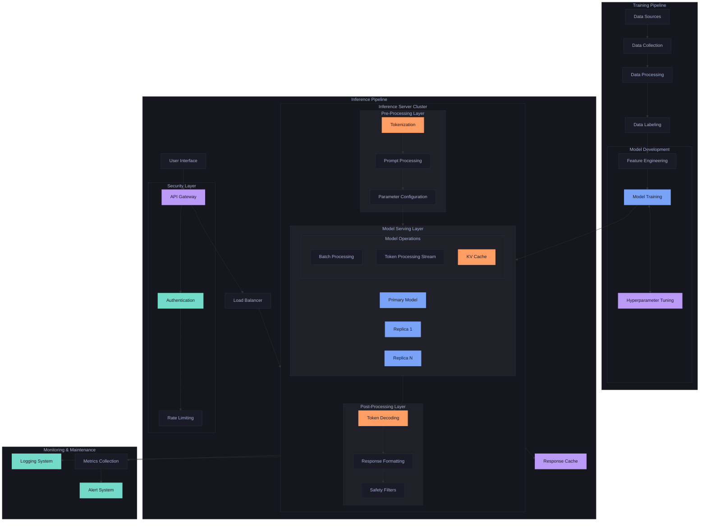

```mermaid
flowchart TB
    %% Define modern AI-themed styles
    classDef default fill:#1a1b26,stroke:#2c2e3b,stroke-width:1px,color:#a9b1d6
    classDef primary fill:#7aa2f7,stroke:#7aa2f7,stroke-width:2px,color:#1a1b26
    classDef secondary fill:#bb9af7,stroke:#bb9af7,stroke-width:2px,color:#1a1b26
    classDef accent fill:#73daca,stroke:#73daca,stroke-width:2px,color:#1a1b26
    classDef highlight fill:#ff9e64,stroke:#ff9e64,stroke-width:2px,color:#1a1b26

    subgraph Training[Training Pipeline]
        D[Data Sources] --> DC[Data Collection]
        DC --> DP[Data Processing]
        DP --> DL[Data Labeling]
        DL --> FE[Feature Engineering]
        FE --> MT[Model Training]
        
        subgraph ModelDev[Model Development]
            FE
            MT
            HP[Hyperparameter Tuning]
            MT <--> HP
        end
    end

    subgraph Inference[Inference Pipeline]
        UI[User Interface] --> API[API Gateway]
        API --> LB[Load Balancer]
        
        subgraph InferenceServers[Inference Server Cluster]
            direction TB
            
            subgraph PreProcessing[Pre-Processing Layer]
                Tokenizer[Tokenization]
                PP[Prompt Processing]
                PC[Parameter Configuration]
            end
            
            subgraph ModelServing[Model Serving Layer]
                direction LR
                ModelA[Primary Model]
                ModelB[Replica 1]
                ModelC[Replica N]
                
                subgraph ModelOps[Model Operations]
                    BatchP[Batch Processing]
                    TPS[Token Processing Stream]
                    KVCache[KV Cache]
                end
            end
            
            subgraph PostProcessing[Post-Processing Layer]
                TD[Token Decoding]
                Format[Response Formatting]
                Filter[Safety Filters]
            end
            
            %% Inference Server Flow
            Tokenizer --> PP
            PP --> PC
            PC --> ModelServing
            ModelServing --> TD
            TD --> Format
            Format --> Filter
        end
        
        LB --> InferenceServers
        InferenceServers --> Cache[Response Cache]
        
        subgraph Security[Security Layer]
            Auth[Authentication]
            Rate[Rate Limiting]
            API --> Auth
            Auth --> Rate
        end
    end

    subgraph Monitoring[Monitoring & Maintenance]
        Log[Logging System]
        Met[Metrics Collection]
        Alert[Alert System]
        
        InferenceServers --> Log
        InferenceServers --> Met
        Met --> Alert
    end

    %% Apply classes to specific nodes
    class MT,ModelA,ModelB,ModelC primary
    class API,Cache,HP secondary
    class Log,Alert,Auth accent
    class Tokenizer,TD,KVCache highlight

    %% Connections between major components
    MT --> ModelServing

    %% Add style definitions for subgraphs
    style Training fill:#16171e,stroke:#2c2e3b,color:#a9b1d6
    style Inference fill:#16171e,stroke:#2c2e3b,color:#a9b1d6
    style Monitoring fill:#16171e,stroke:#2c2e3b,color:#a9b1d6
    style ModelDev fill:#16171e,stroke:#2c2e3b,color:#a9b1d6
    style Security fill:#16171e,stroke:#2c2e3b,color:#a9b1d6
    style InferenceServers fill:#16171e,stroke:#2c2e3b,color:#a9b1d6
    style PreProcessing fill:#1f2028,stroke:#2c2e3b,color:#a9b1d6
    style ModelServing fill:#1f2028,stroke:#2c2e3b,color:#a9b1d6
    style PostProcessing fill:#1f2028,stroke:#2c2e3b,color:#a9b1d6
    style ModelOps fill:#1f2028,stroke:#2c2e3b,color:#a9b1d6
```
