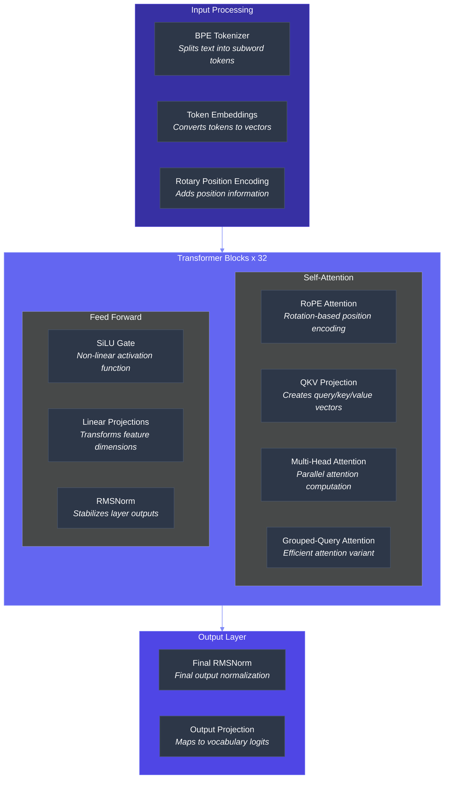

```mermaid
%%{init: {'theme': 'dark', 'themeVariables': { 'primaryColor': '#6366f1', 'primaryTextColor': '#fff', 'primaryBorderColor': '#818cf8', 'lineColor': '#818cf8', 'secondaryColor': '#4f46e5', 'tertiaryColor': '#4338ca'}}}%%
flowchart TB
    subgraph Input["Input Processing"]
        TOK["BPE Tokenizer<br><i>Splits text into subword tokens</i>"]
        EMB["Token Embeddings<br><i>Converts tokens to vectors</i>"]
        POS["Rotary Position Encoding<br><i>Adds position information</i>"]
    end

    subgraph Transformer["Transformer Blocks x 32"]
        direction TB
        subgraph Attention["Self-Attention"]
            RoPE["RoPE Attention<br><i>Rotation-based position encoding</i>"]
            QKV["QKV Projection<br><i>Creates query/key/value vectors</i>"]
            MHA["Multi-Head Attention<br><i>Parallel attention computation</i>"]
            GQA["Grouped-Query Attention<br><i>Efficient attention variant</i>"]
        end

        subgraph FFN["Feed Forward"]
            SiLU["SiLU Gate<br><i>Non-linear activation function</i>"]
            Linear["Linear Projections<br><i>Transforms feature dimensions</i>"]
            RMS["RMSNorm<br><i>Stabilizes layer outputs</i>"]
        end
    end

    subgraph Output["Output Layer"]
        NORM["Final RMSNorm<br><i>Final output normalization</i>"]
        PROJ["Output Projection<br><i>Maps to vocabulary logits</i>"]
    end

    Input --> Transformer
    Transformer --> Output
    
    classDef default fill:#2d3748,stroke:#4a5568,color:#fff
    classDef input fill:#3730a3,stroke:#4338ca,color:#fff
    classDef transformer fill:#6366f1,stroke:#818cf8,color:#fff
    classDef output fill:#4f46e5,stroke:#6366f1,color:#fff
    
    class Input input
    class Transformer transformer
    class Output output
    class TOK,EMB,POS,RoPE,QKV,MHA,GQA,SiLU,Linear,RMS,NORM,PROJ primary
```
