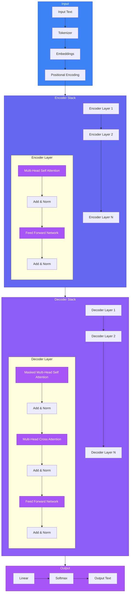
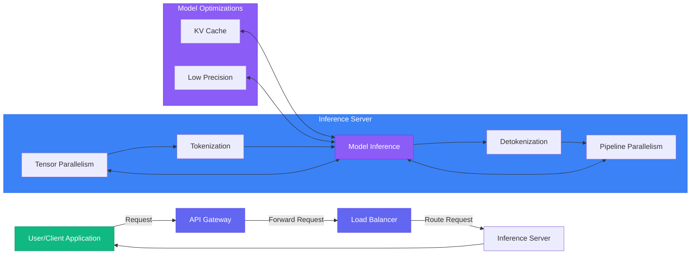
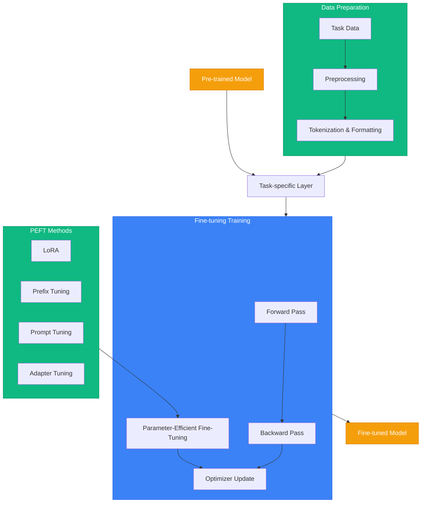
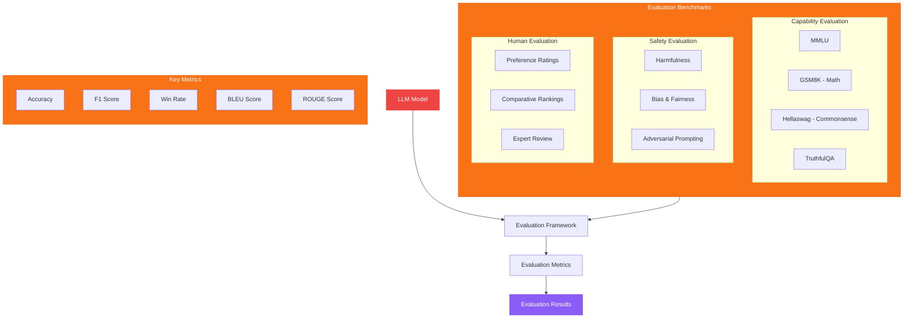

# LLM Architecture Diagrams

This document showcases various architectural patterns for Large Language Models using Mermaid diagrams.

## Basic Transformer Architecture

## LLM Inference Pipeline

## Fine-tuning Process

## LLM Evaluation Framework

These diagrams provide a visual representation of different aspects of LLM architecture and workflows. They can be used for educational purposes or as reference materials when designing LLM-based systems.