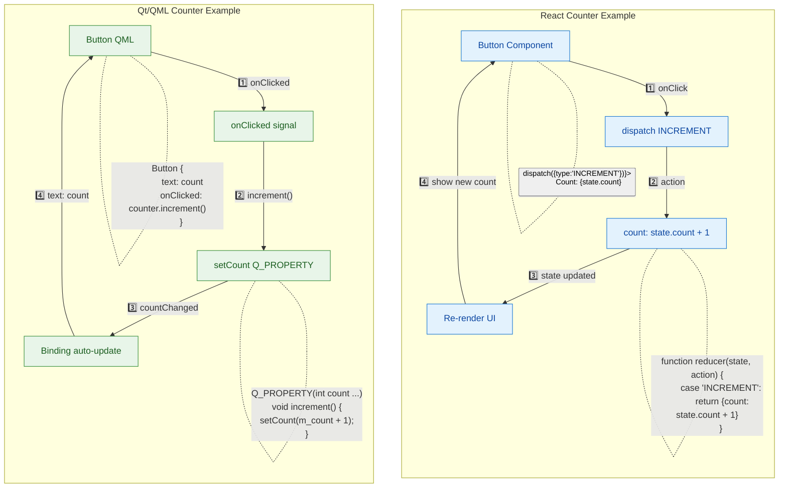

```mermaid
graph TB
    subgraph "React Counter Example"
        direction TB
        UI[Button Component]
        D[dispatch INCREMENT]
        ST[count: state.count + 1]
        RND[Re-render UI]
        
        UI -->|"1️⃣ onClick"| D
        D -->|"2️⃣ action"| ST
        ST -->|"3️⃣ state updated"| RND
        RND -->|"4️⃣ show new count"| UI
    end

    subgraph "Qt/QML Counter Example"
        direction TB
        QUI[Button QML]
        QD[onClicked signal]
        QST[setCount Q_PROPERTY]
        QRND[Binding auto-update]
        
        QUI -->|"1️⃣ onClicked"| QD
        QD -->|"2️⃣ increment()"| QST
        QST -->|"3️⃣ countChanged"| QRND
        QRND -->|"4️⃣ text: count"| QUI
    end

    %% Example Code Labels
    UI -.-|"<Button onClick={()=>dispatch({type:'INCREMENT'})}>
           Count: {state.count}
           </Button>"| UI
    
    QUI -.-|"Button {
            text: count
            onClicked: counter.increment()
           }"| QUI
    
    ST -.-|"function reducer(state, action) {
           case 'INCREMENT':
             return {count: state.count + 1}
           }"| ST
    
    QST -.-|"Q_PROPERTY(int count ...)
            void increment() {
              setCount(m_count + 1);
            }"| QST

    classDef react fill:#e3f2fd,stroke:#1976d2,color:#0d47a1
    classDef qt fill:#e8f5e9,stroke:#388e3c,color:#1b5e20
    classDef code fill:#f5f5f5,stroke:#9e9e9e,color:#212121

    class UI,D,ST,RND react
    class QUI,QD,QST,QRND qt
```
