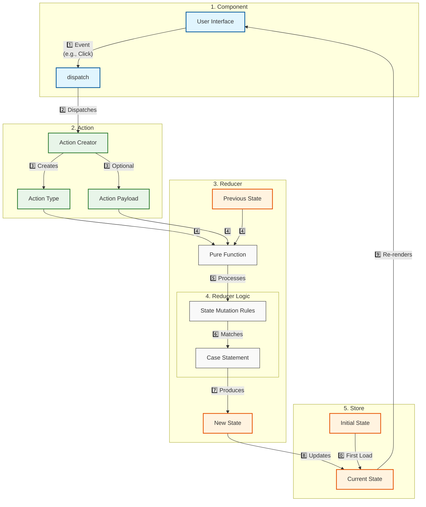

```mermaid
graph TB
    subgraph "1. Component"
        UI[User Interface]
        D[dispatch]
    end
    
    subgraph "2. Action"
        A[Action Creator]
        AT[Action Type]
        AP[Action Payload]
    end
    
    subgraph "3. Reducer"
        R[Pure Function]
        PS[Previous State]
        NS[New State]
        
        subgraph "4. Reducer Logic"
            RM[State Mutation Rules]
            RC[Case Statement]
        end
    end
    
    subgraph "5. Store"
        IS[Initial State]
        CS[Current State]
    end

    %% Flow with numbered steps
    UI -->|"1️⃣ Event\n(e.g., Click)"| D
    D -->|"2️⃣ Dispatches"| A
    A -->|"3️⃣ Creates"| AT
    A -->|"3️⃣ Optional"| AP
    AT -->|"4️⃣"| R
    AP -->|"4️⃣"| R
    PS -->|"4️⃣"| R
    R -->|"5️⃣ Processes"| RM
    RM -->|"6️⃣ Matches"| RC
    RC -->|"7️⃣ Produces"| NS
    NS -->|"8️⃣ Updates"| CS
    CS -->|"9️⃣ Re-renders"| UI
    IS -->|"0️⃣ First Load"| CS

    classDef default fill:#f9f9f9,stroke:#333,stroke-width:1px;
    classDef highlight fill:#e1f5fe,stroke:#01579b,stroke-width:2px;
    classDef action fill:#e8f5e9,stroke:#2e7d32,stroke-width:2px;
    classDef state fill:#fff3e0,stroke:#e65100,stroke-width:2px;
    
    class UI,D highlight;
    class A,AT,AP action;
    class IS,CS,PS,NS state;
```
