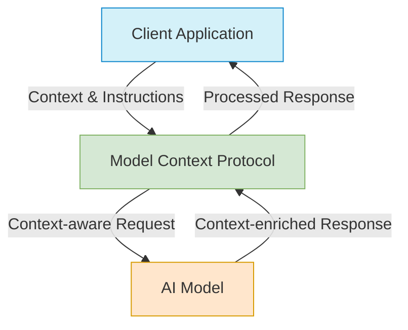
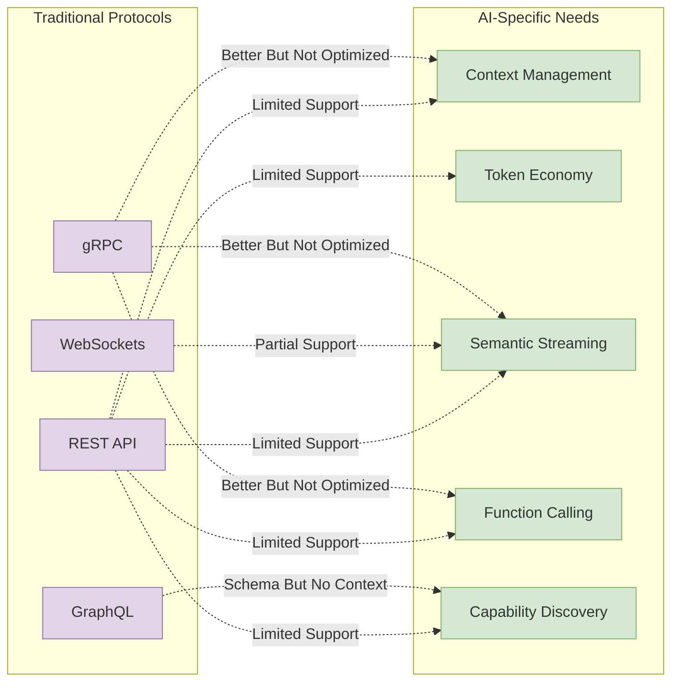
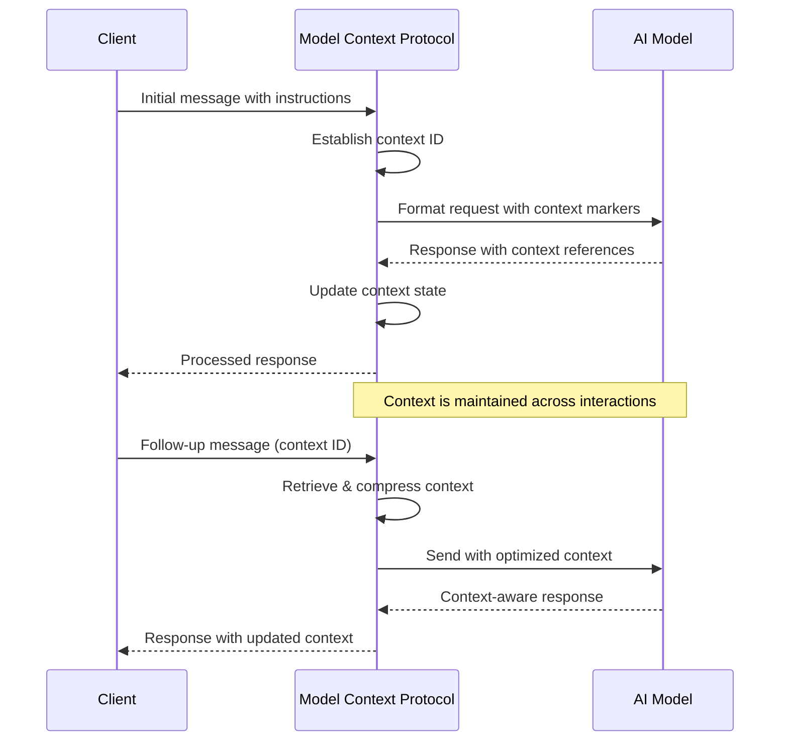
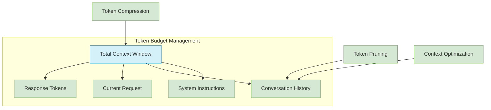
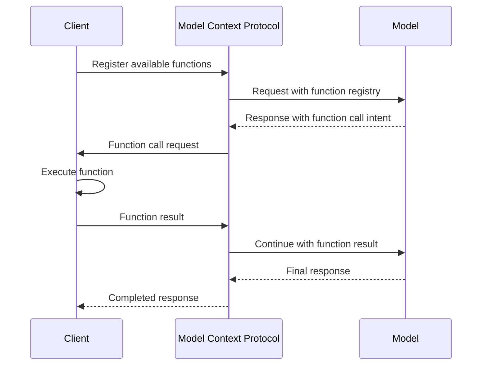
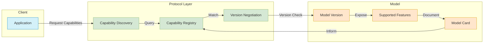
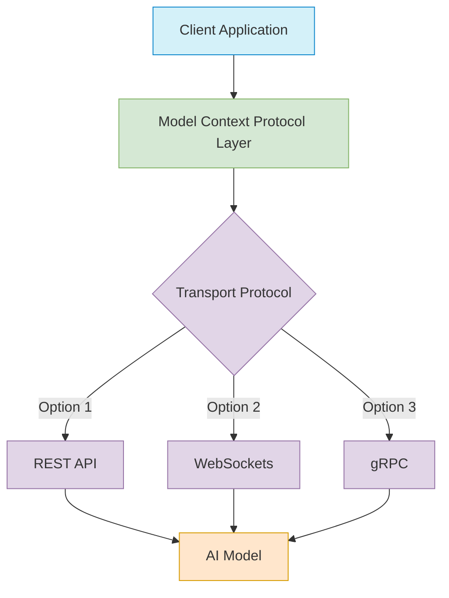
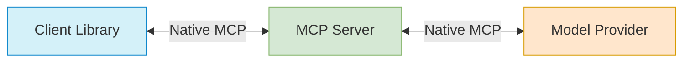
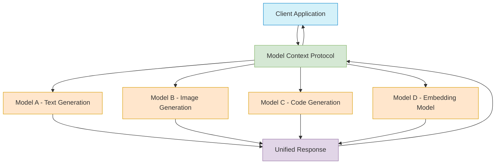
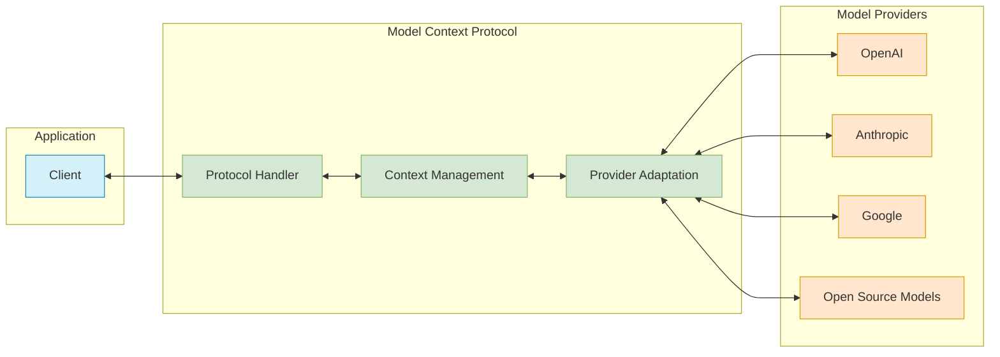

# Understanding the Model Context Protocol: Beyond REST APIs

This tutorial explains the concept of the Model Context Protocol, why it's needed despite the existence of REST APIs and other traditional protocols, and how it can improve interoperability between AI systems.

## What is the Model Context Protocol?

The Model Context Protocol is a specialized communication protocol designed for AI model interactions that focuses on maintaining context, managing tokens, and handling the unique aspects of large language model (LLM) communications.



## Why We Need a Specialized Protocol

### Limitations of Existing Protocols

While REST APIs, GraphQL, gRPC, and WebSockets are excellent general-purpose protocols, they weren't designed with the unique challenges of AI model interactions in mind:

1. **Context Management**: Traditional protocols don't have built-in mechanisms for efficient context management
2. **Token Economy**: No native concept of token counting or token budget management
3. **Streaming Responses**: Limited support for bidirectional streaming with context awareness
4. **Semantic Understanding**: No built-in mechanisms for semantic versioning of capabilities
5. **Function Calling**: Lack of standardized function calling conventions specific to AI operations



## Key Features of the Model Context Protocol

### 1. Context-Aware Communication

The protocol maintains a coherent conversation history that can be efficiently transmitted, compressed, and referenced:



### 2. Token Economy Management

The protocol tracks token usage and manages token budgets efficiently:



### 3. Standardized Function Calling

Enables models to invoke client-side functions in a standardized way:



### 4. Semantic Capability Discovery

The protocol includes mechanisms for semantic versioning of model capabilities:



## Implementation Approaches

The Model Context Protocol can be implemented in several ways:

### 1. As a Layer Over Existing Protocols



### 2. As a Complete End-to-End Protocol



## Real-World Applications

### Multi-Model Orchestration



### Cross-Provider Interoperability



## Benefits of Adopting the Model Context Protocol

1. **Reduced Complexity**: Standardized way to handle model interactions
2. **Improved Efficiency**: Optimized context management and token usage
3. **Enhanced Interoperability**: Easier to switch between model providers
4. **Future-Proofing**: Designed to evolve with AI model capabilities
5. **Specialized Features**: Built specifically for the unique needs of LLM communication

## Challenges and Considerations

1. **Adoption Curve**: Requires industry-wide adoption to achieve full benefits
2. **Implementation Complexity**: May require changes to existing systems
3. **Performance Overhead**: Additional protocol layer may introduce latency
4. **Standardization Process**: Needs governance structure for ongoing development

## Getting Started with Model Context Protocol

### Basic Implementation Pattern

```javascript
// Sample pseudocode for using a Model Context Protocol client

// Initialize the protocol client
const mcp = new ModelContextProtocol({
  contextWindow: 16384,
  tokenCompression: true,
  capabilities: ['function_calling', 'streaming', 'context_optimization']
});

// Register function capabilities
mcp.registerFunction('search_database', {
  parameters: { /* schema */ },
  description: 'Search the database for information'
});

// Start a conversation
const contextId = await mcp.createContext({
  system: 'You are a helpful assistant with access to a database.'
});

// Send a message
const response = await mcp.sendMessage(contextId, {
  content: 'Find information about renewable energy projects.',
  max_tokens: 1000
});

// Handle function calls
mcp.on('function_call', async (call) => {
  if (call.name === 'search_database') {
    const result = await database.search(call.parameters);
    return result;
  }
});

// Stream the response
response.on('token', (token) => {
  console.log(token);
});
```

## Next Steps

1. Explore existing implementations of the Model Context Protocol
2. Consider how your architecture could benefit from this approach
3. Start with a small proof-of-concept implementation
4. Contribute to the evolving standards in this space

## Related Concepts

- [Function Calling in LLMs](link-to-tutorial)
- [Token Management Best Practices](link-to-tutorial)
- [Multi-Modal AI Orchestration](link-to-tutorial)
- [AI System Architecture Patterns](link-to-tutorial)

## Conclusion

As AI systems become more complex and intertwined with our software architectures, specialized protocols like the Model Context Protocol will be essential for efficient, reliable, and standardized communication. While traditional protocols can be adapted to work with AI models, purpose-built protocols provide significant advantages in terms of context management, token efficiency, and AI-specific features.

By understanding and implementing the Model Context Protocol, you can future-proof your AI integrations and unlock more sophisticated model interaction patterns.
