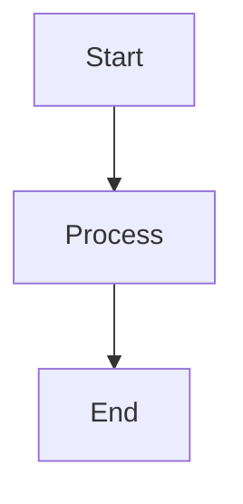
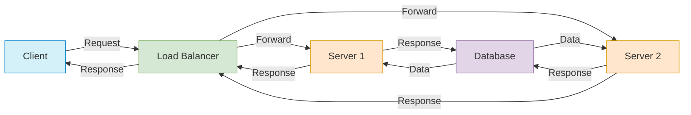
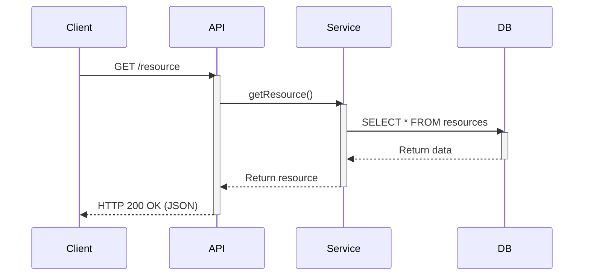
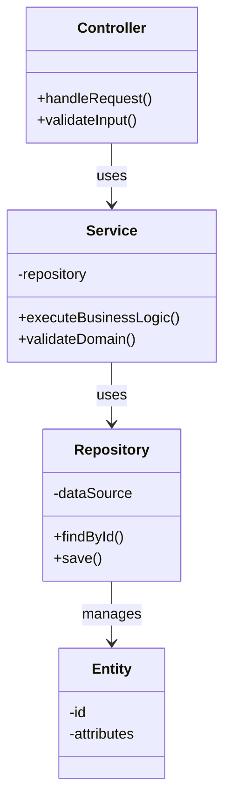
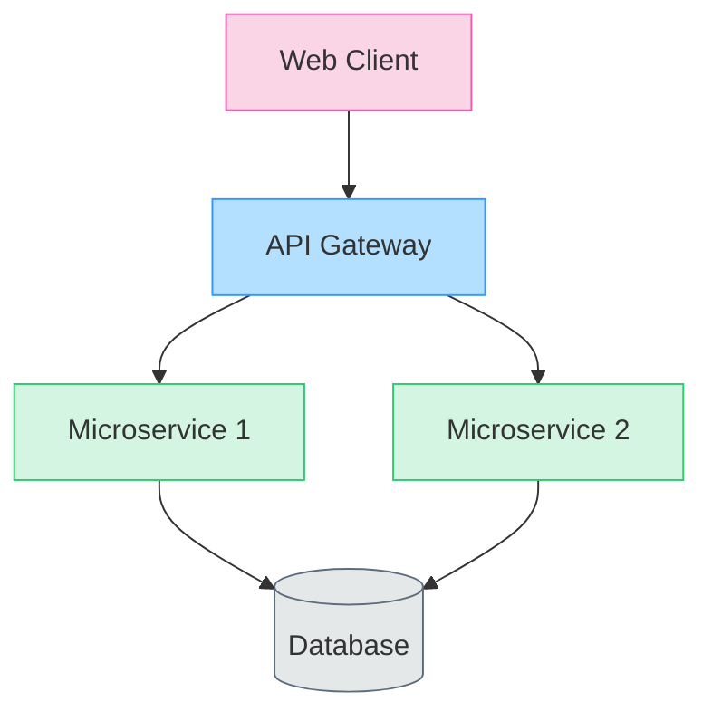
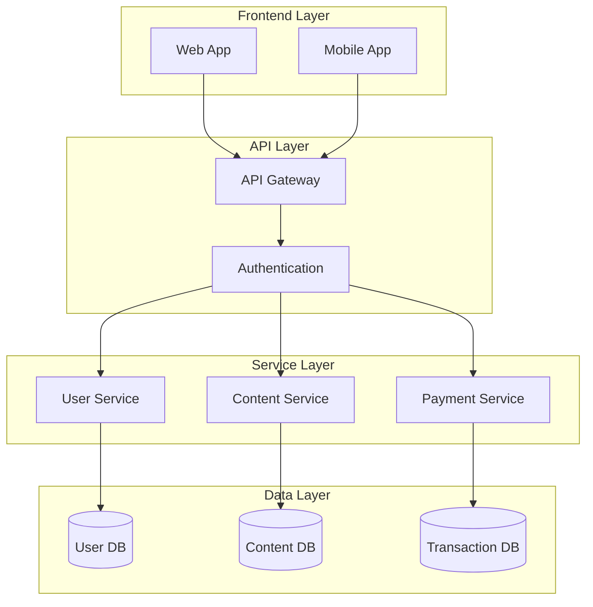
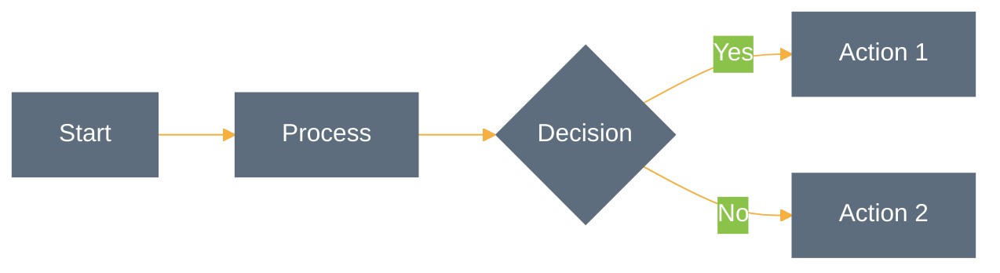

# Getting Started with Mermaid for Architecture Diagrams

This tutorial will introduce you to Mermaid, a powerful JavaScript-based diagramming and charting tool that renders Markdown-inspired text definitions to create and modify diagrams.

## Why Mermaid?

Mermaid has several advantages for creating architecture diagrams:

- **Simple text-based syntax** - easy to learn and modify
- **Version control friendly** - changes can be tracked in Git
- **Renders directly in GitHub** - no need for external tools or image hosting
- **Wide range of diagram types** - flowcharts, sequence diagrams, class diagrams, and more
- **Customizable styling** - colors, shapes, and themes

## Basic Syntax

Mermaid diagrams are defined within code blocks with the `mermaid` language specified:

````markdown

````

This will render as:


## Diagram Types for Architecture Documentation

### 1. Flowcharts (graph)

Flowcharts are ideal for showing system processes and data flows.



#### Key Flowchart Syntax:

- **Direction**: 
  - `graph TD` (top-down)
  - `graph LR` (left-right)
  - `graph RL` (right-left)
  - `graph BT` (bottom-top)

- **Nodes**:
  - `A` (simple node)
  - `A[Text]` (rounded rectangle)
  - `A(Text)` (stadium shape)
  - `A((Text))` (circle)
  - `A>Text]` (asymmetric shape)
  - `A{Text}` (rhombus)
  - `A{{Text}}` (hexagon)
  - `A[/Text/]` (parallelogram)
  - `A[\Text\]` (parallelogram alt)
  - `A[/Text\]` (trapezoid)
  - `A[\Text/]` (trapezoid alt)

- **Connections**:
  - `A --> B` (arrow)
  - `A --- B` (line)
  - `A -.-> B` (dotted arrow)
  - `A ==> B` (thick arrow)
  - `A --Text--> B` (arrow with text)
  - `A -->|Text| B` (arrow with text alt)

### 2. Sequence Diagrams

Ideal for showing interactions between components over time:



### 3. Class Diagrams

Perfect for modeling system architecture and relationships:



## Adding Style with Classes

You can style your diagrams with CSS-like classes:



## Subgraphs for Component Grouping

Use subgraphs to group related components:



## Tips for Creating Effective Architecture Diagrams

1. **Start simple**: Begin with the main components and add details incrementally
2. **Use consistent styling**: Establish a color scheme for different component types
3. **Group related components**: Use subgraphs to organize your diagram
4. **Add clear labels**: Make sure connections and nodes have descriptive labels
5. **Consider the audience**: Adjust detail level based on who will be viewing the diagram
6. **Maintain clean syntax**: Format your Mermaid code for readability
7. **Include a legend**: Add a subgraph as a legend to explain symbols and colors

## Theme Configuration

You can customize the overall appearance with theme configuration:



## Next Steps

Now that you understand the basics of Mermaid:

1. Try creating a simple architecture diagram for a system you're familiar with
2. Explore more advanced features in the [Mermaid documentation](https://mermaid-js.github.io/mermaid/#/)
3. Look at examples in our repository for inspiration
4. Submit your own diagram to contribute to this repository

Happy diagramming!
