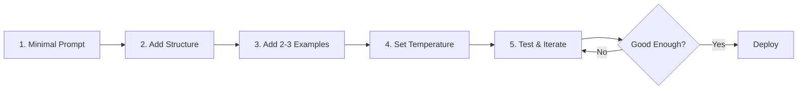

# Quick Reference: 80/20 Prompt Engineering

## The Vital Few (20% Effort → 80% Results)

### 1. Format & Structure (40% impact)
```python
# ❌ Poor: Unstructured
"summarize this and make it good"

# ✅ Good: Structured with XML (Claude)
"""
<task>Summarize the document</task>
<format>3 bullet points, max 50 words each</format>
<document>{content}</document>
"""

# ✅ Good: JSON format (GPT)
{
  "task": "summarize",
  "format": "bullet_points",
  "max_length": 150,
  "document": content
}
```

### 2. Temperature Settings (20% accuracy, 40% cost reduction)
```python
# Optimal settings by use case:
FACTUAL_TASKS = 0.0 - 0.2  # Data extraction, Q&A
BALANCED_TASKS = 0.3 - 0.7  # General assistance
CREATIVE_TASKS = 0.8 - 1.0  # Brainstorming, fiction
```

### 3. Few-Shot Examples (11-15% improvement)
```python
# ✅ Optimal: 2-3 diverse examples
prompt = """
Classify sentiment:

Example 1: "This product exceeded expectations!" → Positive
Example 2: "Completely unusable, waste of money." → Negative
Example 3: "It works, but nothing special." → Neutral

Classify: "{user_input}"
"""

# ❌ Diminishing returns: 10+ examples
# Beyond 3 examples rarely helps, often hurts
```

### 4. Clear Instructions (26% F1 improvement in production)
```python
# ❌ Vague
"analyze this data"

# ✅ Specific
"""
Analyze the sales data to:
1. Identify top 3 performing products by revenue
2. Calculate month-over-month growth percentage
3. Flag any anomalies (>50% deviation from mean)
Output as JSON with keys: top_products, growth_rate, anomalies
"""
```

### 5. Output Constraints (65% compliance improvement)
```python
# Structured output with schema
response_schema = {
    "summary": "string, max 100 words",
    "key_points": ["string", "max 3 items"],
    "sentiment": "positive|negative|neutral",
    "confidence": "float between 0-1"
}
```

## The Trivial Many (80% Effort → 20% Results)

### ❌ Avoid Over-Engineering:
- Chain-of-thought for modern reasoning models (2-3% gain, 20-80% slower)
- More than 3-5 examples (negligible improvement)
- Complex multi-step prompts (increases errors)
- Excessive prompt variants (>64 shows no benefit)
- Verbose instructions (simpler often better)

## The 5-Step Framework



## Production Checklist

- [ ] **Format First**: Use XML/JSON structure before wordsmithing
- [ ] **Task First**: Put instructions before context
- [ ] **Temperature**: Set to 0.0-0.2 for accuracy-critical tasks
- [ ] **Examples**: Limit to 2-3, focus on edge cases
- [ ] **Constraints**: Define output format explicitly
- [ ] **Test**: Use pass/fail criteria, not subjective scoring
- [ ] **Stop**: When output meets requirements (not perfection)

## Model-Specific Tips

### Claude (Anthropic)
- XML tags boost performance 15%
- Use `<thinking>` tags for reasoning
- Prefill responses for consistent format

### GPT (OpenAI)
- JSON format often outperforms text
- System message most important
- Use delimiters (###, ```) for sections

### Gemini (Google)
- "Persona + Task + Context + Format" framework
- 21 words optimal for instructions
- Direct reference text inclusion

## Cost Analysis

| Approach | Relative Cost | Time to Deploy | Performance |
|----------|--------------|----------------|-------------|
| Basic Prompting | 1x | Minutes | Baseline |
| Optimized Prompting | 1x | Hours | +20-40% |
| Complex Prompting | 1.2-1.8x | Days | +22-45% |
| Fine-tuning | 30x | Weeks | +25-50% |

## When to Stop Optimizing

Stop when you hit any of these:
- Output meets business requirements
- Marginal improvements < 2%
- Optimization time > value of improvement
- Using latest reasoning models (o1, o3, DeepSeek-R1)

## Red Flags (Diminishing Returns)

🚩 Spending hours on wording instead of structure
🚩 Using 10+ examples
🚩 Complex CoT with reasoning-capable models
🚩 Prompt longer than 500 words
🚩 Multiple optimization rounds with <5% gains

## Remember

> "The best prompt is the simplest one that works."

- **Format > Words**
- **Structure > Length**
- **Clear > Clever**
- **Good Enough > Perfect**

---

*Based on 40+ studies (2022-2025) showing 20% of techniques deliver 80% of results*